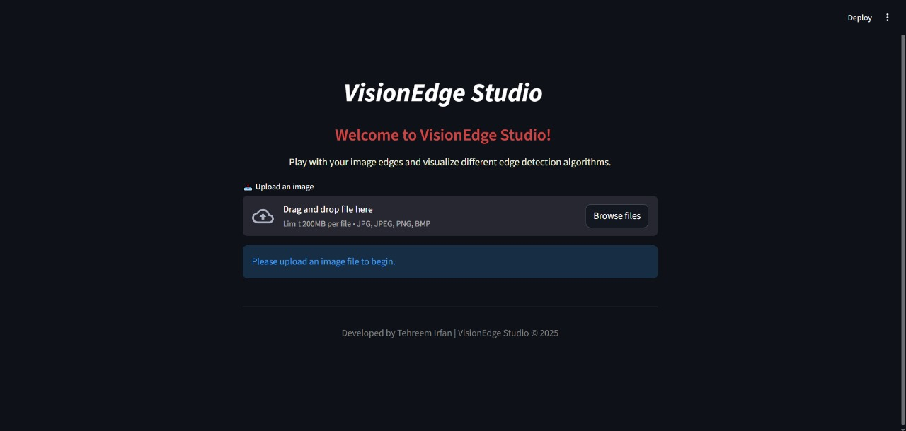
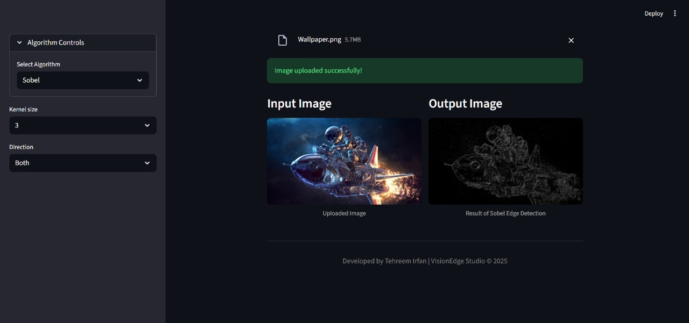
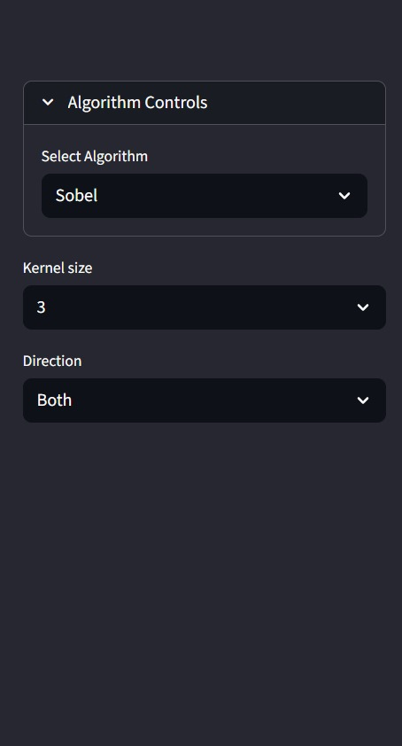
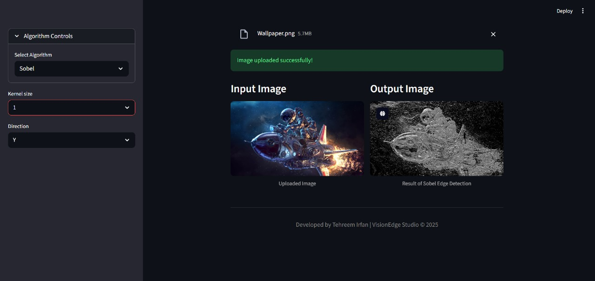
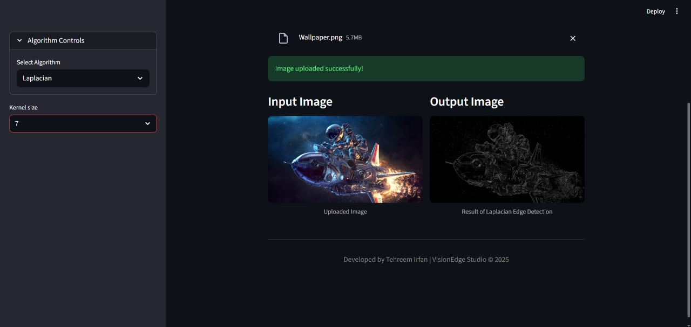
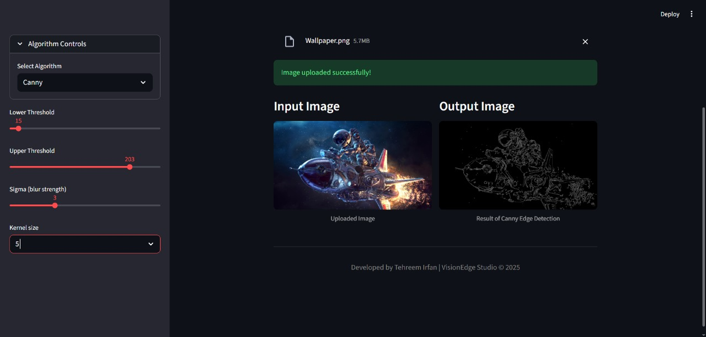

# VisionEdge Studio

**VisionEdge Studio** is an interactive image processing web app built with **Streamlit** that allows users to visualize and experiment with different **edge detection algorithms** such as **Sobel**, **Laplacian**, and **Canny**.  

The app provides an intuitive interface for uploading images, adjusting algorithm parameters in real-time, and comparing original and processed images side-by-side — perfect for learning, research, and computer vision demonstrations.

---

## Features

- Upload any image (JPG, JPEG, PNG, BMP)
- Apply different edge detection algorithms:
  - **Sobel Operator**
  - **Laplacian Operator**
  - **Canny Edge Detector**
- Interactive parameter tuning:
  - Kernel size selection
  - Direction control (for Sobel)
  - Canny thresholds and Gaussian blur settings
- Automatic preprocessing (Gaussian smoothing)
- Side-by-side comparison of input and output images
- Clean, centered UI with a built-in footer and theme customization

---

## Tech Stack

- **Python 3.13.7**
- **Streamlit** (for UI and deployment)
- **OpenCV (cv2)** (for image processing)
- **NumPy**
- **Pillow (PIL)**
- **numpy==2.2.6**
- **pillow==11.3.0**
- **opencv-python==4.12.0.88**
- **streamlit==1.50.0**

---

## Setup and Installation

Follow these steps to set up **VisionEdge Studio** locally on your system.

### 1️⃣ Clone the repository

- git clone https://github.com/Tehreemirfan123/VisionEdge-Studio
- cd VisionEdge-Studio

### 2️⃣ Install Dependencies and the requirements

Install all required libraries and run:

- pip install streamlit opencv-python pillow numpy

- pip install -r requirements.txt

### 3️⃣ Run the Application

Start the Streamlit app by running:

- streamlit run app.py

Once it starts, your browser will automatically open the app at:

- http://localhost:8501

### 4️⃣ Optional tip

To ensure the app runs exactly as intended, it’s recommended to use a virtual environment:

- python -m venv venv
- venv\Scripts\activate

Once activated, your terminal prompt will show (venv) at the start.And then run

- pip install -r requirements.txt inside it.

Inside the same virtual environment, run the Streamlit app:

- streamlit run app.py

---

### Additional Features Implemented

- Auto-expanding sidebar controls upon image upload for user convenience
- Kernel size dropdown (odd values only) for accurate Gaussian blurring
- Custom pointer cursor for all dropdowns
- Dynamic footer with developer credit
- Fully centered, minimal UI theme for a clean and modern look

---

### 💻 Developer

Developed with ❤️ by Tehreem Irfan
© 2025 VisionEdge Studio

--- 

## Screenshots and Images

### App UI

- Figure 1 – Shows the actual default UI of the app (VisionEdge Studio).

### Image Uploading 

- Figure 2 – Shows an image being uploaded from user's computer.

### Algorithm Controls

- Figure 3 – Shows the algorithms and parameters controlling tab.

### Sobel Edge Detection Example

- Figure 4 – Sobel Edge Detection changing parameters (Direction and Kernel size).

### Laplacian Edge Detection Example

- Figure 5 – Laplacian Edge Detection changing parameter (Kernel size).

### Canny Edge Detection Example

- Figure 6 – Canny Edge Detection changing parameters (Lower/upper thresholds, sigma and kernel size).
